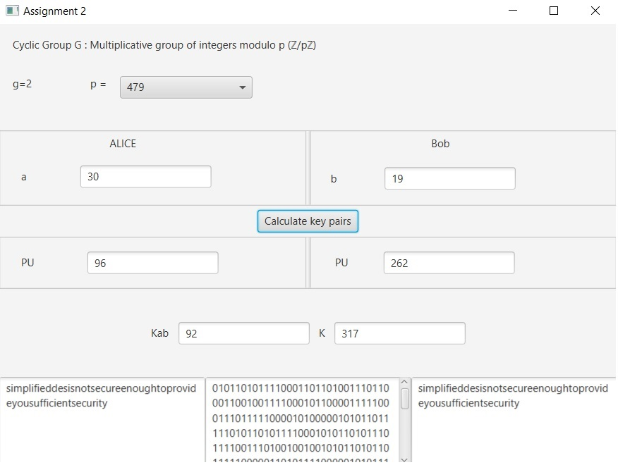

# DAT510 Assignment Two

A simple cryptology Java project with an JavaFx interface which implement a secure communication scheme.
It was made with Intellij IDEA

# Requirements
Need Java 9 or higher to be run because of JavaFx.
The project use a jar file called dat510.jar from the last assignment :  https://github.com/folowbaka/dat510 .

It need to be added to the project if you are using an IDE or in the command line :
```
javac -cp dat510.jar Main.java
java -cp dat510.jar;. Main or java -cp dat510.jar:. Main
```

# Structure
```
├── src
|    ├── Controller.java  Contains all the methods triggered by the interface      
|    ├── Main.java        Java class to run      
|    ├── sample.fxml      fxml file which define the interface      
|    ├── BBS.java         Java class where the BBS logic is
|    ├── dat510.jar       Jar file of the last assignment for the use of SDES
|    └── DIH.java         Java class where the DIH logic is    
|
└──README.md
 ```
# Screens

